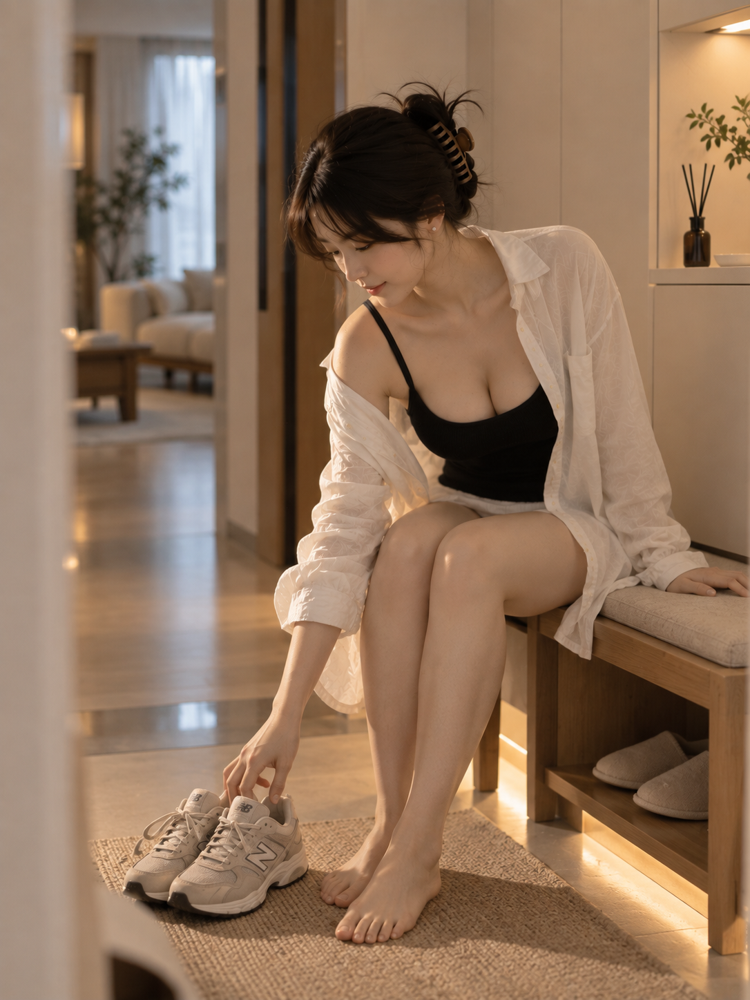

# Silas Candid Photography Pro

把人物参考、固定穿搭与生活场景，整理成可复现、有空间层次、有自然动作与表情变化的抓拍摄影提示词。

适用于支持本地 `SKILL.md` 的 AI 助手。默认输出 10 条中文提示词；明确要求生成图片时，才调用当前环境可用的图片工具。

## 示例作品

以下三张为作者提供的 AI 生成示例，展示同一人物、同一套穿搭在不同居家空间中的变化。图片直接展示在本页，点击可查看原图。

这三张为保留的既有作品，不是新版动作多样性规则的生图验收结果。

### 01 · 玄关收鞋

暖白柜体与木质换鞋凳、傍晚侧光、进行中的收鞋动作。



### 02 · 餐桌插花

延续人物与穿搭，以花枝前景、餐桌斜线和窗边柔光建立层次。


### 03 · 洗手台前

磨砂窗光与暖白镜灯、可读的手部动作，以及真实水流细节。


## 能做什么

- **锁定明确要求**：人物、穿搭、地点、镜头、构图等指定条件在方案生成与修复中保持不变。
- **分配参考图职责**：身份、服装、环境、构图、光线、风格分别控制，避免混用。
- **组织批量变化**：表情、动作、景别、焦段、机位、前景、光线与色彩共同组成可拍摄的瞬间。
- **减少僵硬与同质姿态**：先设计动作原因、头肩联动、视线目标、面部反应及重心支撑，再组织镜头；不仅更换房间，也区分人物正在做什么、看什么、有什么反应。
- **复现方案**：Python 组合器输出最终方案、实际 seed、修复记录与警告；相同输入与 seed 可复现方案。
- **检查生成结果**：生图模式按 100 分量表检查，最多进行两轮有针对性的质量修复。

默认人物为韩系 INS 风格成年女性；用户指定的人物或身份参考优先。穿搭和美学标签会被转写成可见的材质、版型、颜色和覆盖关系。

## 自然动作与表情

“同一人物”不等于“同一张静止的脸”。新版区分身份和表演：身份参考保留五官与体态，只有用户明确指定姿势参考时才沿用其低头、垂眼或固定微笑。

每个瞬间先建立 **动作原因 → 身体响应 → 视线目标 → 可见表情 → 物理结果**。例如思考时托腮抬眼、收到消息后笑起来、拧紧的盖子带来用力表情、舒适伸展时视线追随手部；这些是可迁移的动作类型，不是固定的居家十连拍模板。人物、性别、服装、场景与情绪仍由用户决定。

批量设计会检查动作类型、头部与视线组合、情绪强弱，避免每张都是“低头整理头发”。用户要求安静、低头阅读、固定动作时优先遵守，不会强制大笑、瑜伽、看镜头或更换衣服。细则见 [自然表演设计](references/natural-performance.md)。

## 安装

将本仓库完整放入你的 AI 助手所使用的 skills 目录，并以 `silas-candid-photography-pro` 命名目录。保留 `SKILL.md`、`references/`、`scripts/` 和 `agents/` 的相对结构。

例如，使用默认个人 skills 目录的 Codex 环境可运行以下命令；如果目标目录已存在，先检查已有内容：

```sh
git clone https://github.com/SilasMaker/silas-candid-photography-pro.git "$HOME/.codex/skills/silas-candid-photography-pro"
```

随后在新对话中调用 `$silas-candid-photography-pro`。

## 使用示例

### 只生成提示词

```text
$silas-candid-photography-pro
生成 10 条中文自然抓拍提示词，3:4 竖幅，暖白淡雅风格。
```

### 锁定人物与穿搭，变化居家场景

```text
$silas-candid-photography-pro
图 A 只负责人物身份，图 B 负责穿搭和暖白淡雅风格。
保持人物与图 B 的衣服、衣长、叠穿关系不变。
在同一套住宅的客厅、阳台、卧室、餐厅和洗手台前设计 10 条提示词。
每条包含具体的动作原因、自然头肩联动、明确视线目标、表情和支撑关系，
并安排机位、前景和有来源的光线。不要只换背景，人物动作与反应也要有变化。只输出提示词。
```

### 明确要求生图

```text
$silas-candid-photography-pro
以附件人物作为身份参考，保持指定穿搭，生成 3 张自然居家抓拍图片。
分别在沙发、餐桌和阳台，生成后检查身份、穿搭与动作是否符合要求。
```

需在对话中提供自己的参考图；仓库示例不会自动作为身份参考。生图依赖宿主环境可用的图片工具，本仓库不包含图片模型、API 密钥或服务调用凭据。

## 运行方案组合器

在仓库根目录运行，需要 Python 3.10 或更高版本，组合器只使用标准库：

```sh
python3 scripts/compose_plan.py --request-json '{"count":10,"mode":"prompt","seed":20260905,"aspect_ratio":"3:4","identity_policy":"high","locks":{"wardrobe":"暖白宽松衬衫叠穿黑色背心，保持衣长与叠穿关系"}}'
```

返回 `normalized_request`、`plans`、`repairs`、`seed`、`version` 和 `warnings`。自然语言提示词应只根据返回的最终方案编写。出现兼容性或多样性警告时，按 [SKILL.md](SKILL.md) 的处理规则先解决再输出。

`locks` 接受表情、穿搭、场景、动作、景别、焦段、机位、构图、前景、光线、色彩及摄影状态等字段；天气和时段可以写入场景或光线描述。`references` 保存参考图角色，`reference_controls` 保存从参考图提取的具体控制值。

上述不带 `shots` 的命令保留旧版随机探索方式。实际生成完整提示词时，助手先编写长度等于 `count` 的有序 `shots` 数组，每项至少包含协调好的 `action`（动作与头部、身体机制）和 `expression`（视线目标与可见表情），并补足该镜头的其他视觉字段。示例请求见 [自然表演设计](references/natural-performance.md#map-to-the-composer)。

优先级为共享 `locks` → `reference_controls` → 当前 `shots` 项 → 随机默认值。`shots` 不会覆盖共享的人物/穿搭等约束；冲突会返回警告。有 `shots` 时允许同一地点、同一机位下的不同表演，检查完全相同的动作/表情组合；近义改写、视线几何和身体合理性仍由助手审查。不能靠十次独立调用跳过整组审查。

组合器的兼容性检查覆盖内置规则；自定义自然语言仍需要助手判断物理合理性。方案 seed 不等于图片模型 seed，也不保证跨模型生成像素相同的图片。规则与测试旨在减少僵硬倾向，不保证每次生图自然或身份绝对一致；实际图片仍需逐张及整组目视检查。

## 文件结构

```text
SKILL.md                       工作流入口
agents/openai.yaml             助手显示与调用信息
scripts/compose_plan.py         可复现方案组合器
references/aesthetic-system.md  摄影语言与十二个维度
references/natural-performance.md  动作、视线、表情与整组多样性
references/reference-images.md  参考图职责与身份一致性
references/model-adapters.md    不同模型的提示词表达
references/quality-rubric.md    生图质检与定向修复
references/examples.md         多参考图示例
tests/test_compose_plan.py      自动化测试
tests/test_authored_shots.py    逐张动作设计与约束回归测试
assets/examples/               三张公开展示图
```

## 验证

```sh
python3 -B -m unittest discover -s tests -p 'test_*.py' -v
```

测试覆盖锁定条件、参考控制优先级、seed 复现、批量差异、兼容性收敛、输入校验和最终方案字段，以及逐张动作保留、同机位不同表演、重复表演警告和自定义书房阅读。自动化测试不替代生图目视验收。

## 许可

Skill 文本、脚本和相关文档采用 [MIT License](LICENSE)。三张示例图片用于效果展示，不适用代码的 MIT 授权；图片使用范围见 [示例图片说明](assets/examples/README.md)。

作者：[SilasMaker](https://github.com/SilasMaker)
